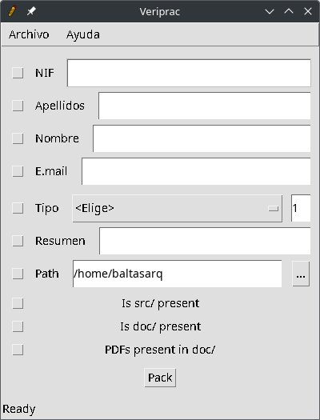

# Veriprac

Verificador y empaquetador de prácticas.

*Verifier and homework packager.*

Comprueba que un mínimo de documentación y estructura están presentes antes de empaquetarlo todo en un archivo *zip*.

*It checks that a minimum of documentation and structure is present before packaging it all in a **zip** file.*



## Build & run
Este proyecto está preparado para ejecutarse en **NetBeans**, pero puede construirse con `ant` de forma independiente.

*This project is prepared to build in **NetBeans**, but builds independently alone with `ant`.*

```bash
$ cd Veriprac/veriprac
$ ant
$ java -jar dist/Veriprac.jar
```

## Instructions
Pulsa `Ctrl + O` o ve a *Archivo >> Abrir* para dirigir la herramienta al directorio en el que se encuentre el proyecto o práctica. Entonces haz clic sibre el botón *Pack*. La herramienta mostrará cualquier error mediante la barra de estado. Aquellos aspectos que se cumplen estarán marcados con un ticket en la parte izquierda.

*Just press `Ctrl + O` or go to *File >> Open* in order to point the tool to the directory in which the project or exercise sits. Then click on the button *Pack*. The tool will output any error through the status bar. Those issues that pass are marked with a ticket on the left side.*


## [License](/LICENSE) 
[MIT License](LICENSE).

